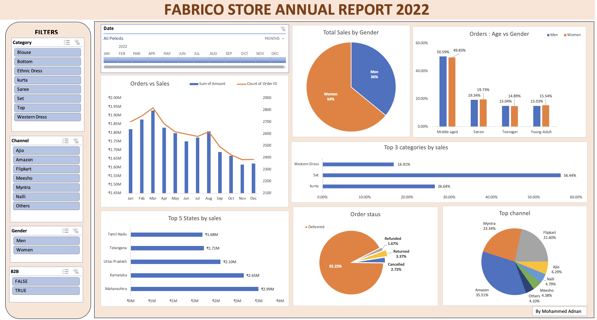

# Fabrico Store: Annual Sales Analysis 2022

An end-to-end Excel analysis of a year of e-commerce clothing sales for Fabrico, an Indian fashion brand. The goal was to build a complete annual report that shows how the business performed, what drove that performance, and where to focus in 2023.

## Business Problem

Fabrico has its full 2022 sales data and wants to understand its customers and drive more sales in 2023. The analysis follows a simple structure:

1. How did the business perform in 2022?
2. What happened, and why?
3. What are the opportunities and problems?
4. What should the business do in 2023?

## Questions Answered

I broke the problem into a decision tree (revenue, customers, products, demographics, date, channel, status) and answered:

- How do sales and orders move together across the year?
- Which month had the highest sales and orders?
- Which gender buys more?
- What are the order statuses (delivered, returned, cancelled, refunded)?
- Which 5 states generate the most sales?
- How do age group and gender relate?
- Which channel contributes the most sales?
- Which categories sell the most?

## Dataset

| Item | Detail |
|---|---|
| Period | January to December 2022 |
| Rows | 31,047 order lines |
| Unique orders | 28,471 |
| Total revenue | ₹21.18M |
| Key fields | Order ID, Customer ID, Gender, Age, Date, Status, Channel, Category, Size, Qty, Amount, Ship-State, B2B |

## Data Cleaning and Transformation

- Removed unnecessary columns.
- Split the combined location column into state, country and pincode.
- Fixed date formats.
- Grouped ages into four brackets with a formula: **Teenager**, **Young-Adult**, **Middle-aged**, **Senior**.
- Added a **Month** column for seasonal analysis.
- Added a unique order ID column after finding 31,047 rows but only 28,471 distinct order IDs.

## Tools

- Microsoft Excel: data cleaning, formulas, PivotTables, PivotCharts, slicers and timeline
- Dashboard built in Excel with interactive filters for Category, Channel, Gender, B2B and Date

## Key Insights

- **Women drive revenue:** they account for 64% of total sales, men 36%.
- **Top states:** Maharashtra (₹2.99M), Karnataka (₹2.65M) and Uttar Pradesh (₹2.10M) lead, followed by Telangana and Tamil Nadu.
- **Top categories:** Set is the clear leader at 56.44% of sales, followed by Kurta (26.64%) and Western Dress (16.91%).
- **Top channels:** Amazon leads with 35.51% of sales, followed by Myntra (23.34%) and Flipkart (21.60%).
- **Customers:** the middle-aged group places the most orders, at about 50% for both men and women.
- **B2B is minor:** it brings in under 1% of revenue.
- **Fulfilment:** 92.25% of orders were delivered; returns (3.37%), cancellations (2.72%) and refunds (1.67%) make up the rest.
- **Seasonality:** sales peaked in March (₹1.93M) and trended down through the second half of the year, ending lowest in November and December.

### Notable Drops

- **April:** sales fell 5.12% from the March peak. Peak months in e-commerce are usually followed by drops of 15-20%, so this is a mild correction.
- **September:** sales fell about 6% from August, which fits the usual pause before Q4 festive and year-end sales.

Explaining these dips properly needs traffic, ad spend and promotion data, none of which are in this dataset.

## Recommendations for 2023

- Target **women in the middle-aged group**.
- Prioritise **Maharashtra, Karnataka and Uttar Pradesh**.
- Push promotions and deals through **Amazon, Myntra and Flipkart**.
- Double down on **Sets**, the biggest revenue driver.
- Plan campaigns for the weaker months (April, September, and Q4) and collect marketing data to measure their impact.

## Author

**Mohammed Adnan**
